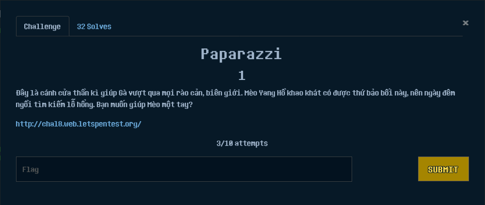
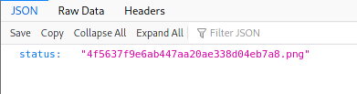
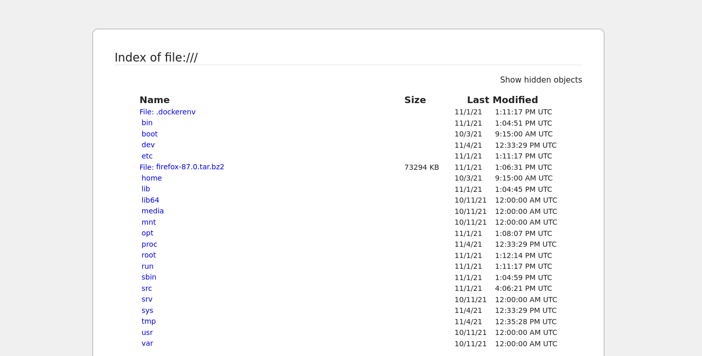
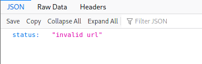
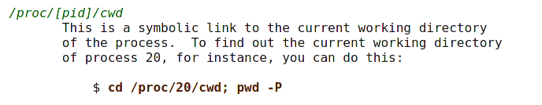
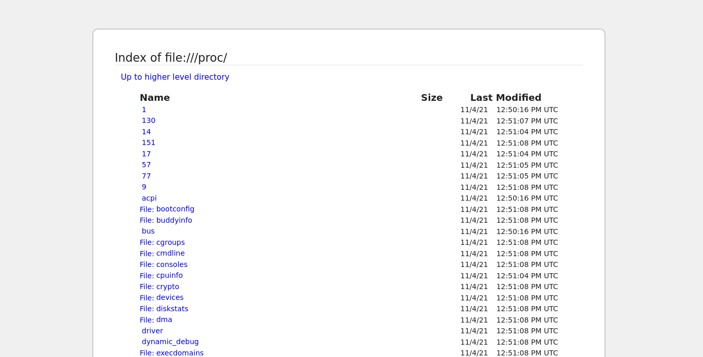
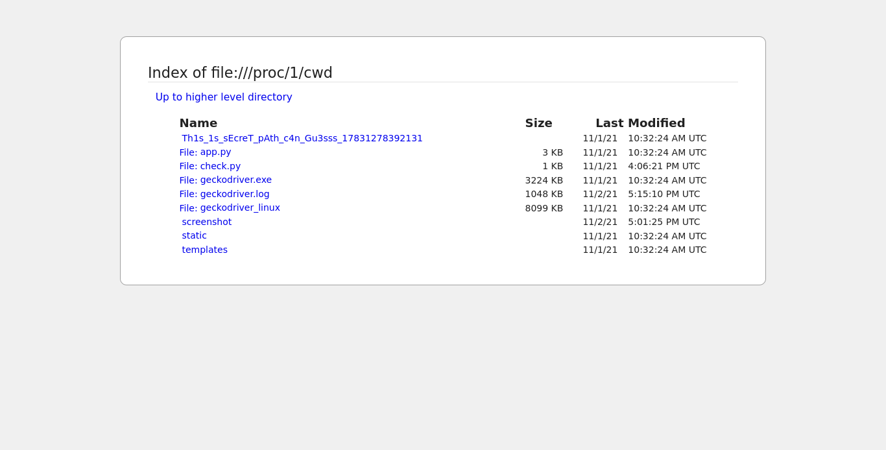
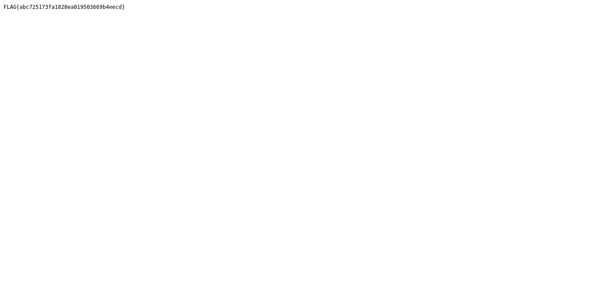

# Paparazzi



Sau khi dạo một vòng, mình nhận thấy ở đây chỉ có nhập vào URL nên mình đoán đây rất có thể là một bài SSRF.

Sau khi nhập thử `file:///` vào mình nhận được json có chứa tên một file png:



Mình tiếp tục tìm trong source thì thấy một đoạn js có vẻ khả nghi:

```js
async function getHistory()
{	
	src = []
	const response = await fetch(window.location.origin + "/get_all_screenshot");
	var data = await response.json();
	let tab = `<h1>History</h1>`;
	console.log(data.status)
	for (let r of data.status) {
		console.log(``);
		tab += ``;
	}
	document.getElementById("history").innerHTML = tab;
}
```

Ở đây `get_screenshot?file=` có vẻ là chỗ để xem file .png ở trên. Boom, và mình đã có screenshot của `/`

```http://chal8.web.letspentest.org/get_screenshot?file=4f5637f9e6ab447aa20ae338d04eb7a8.png```



Sau khi thử tìm lần lượt trong các thư mục đều không thấy flag, riêng `/src` lại bị `url invalid`, mình cũng thử với các URL khác có chứa từ `src` thì nhận ra là từ khoá này đã bị block.



Để bypass cái này và truy cập vào `src` mình dùng thư mục `/proc/[pid]/cwd`:





Mình thử với `pid = 1` thì thấy một thư mục có khả năng cao là chứa flag:



Tiếp tục đi vào trong thì mình tìm được flag`:




Flag: `FLAG{abc725173fa1828ea019503669b4eecd}`