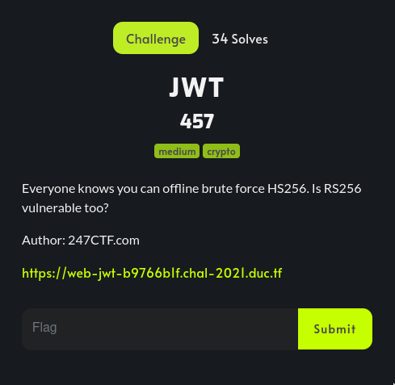

# JWT 

## Summary


#### Source code

```python
from flask import Flask, request
import jwt, time, os

app = Flask(__name__)
app.config['SECRET_KEY'] = os.urandom(24)

private_key = open('priv').read()
public_key = open('pub').read()
flag = open('flag.txt').read()

@app.route("/get_token")
def get_token():
    return jwt.encode({'admin': False, 'now': time.time()}, private_key, algorithm='RS256')

@app.route("/get_flag", methods=['POST'])
def get_flag():
  try:
    payload = jwt.decode(request.form['jwt'], public_key, algorithms=['RS256'])
    if payload['admin']:
      return flag
  except:
    return ":("

@app.route("/")
def sauce():
  return "

%s

" % open(__file__).read()

if __name__ == "__main__":
  app.run(host="0.0.0.0", port=5000)
```

This is a great challenge. I'm so lucky to get firstblood on it xD. 

## Analysis

* In `get_token` function, the token is crafted from `{'admin': False, 'now': time.time()}` using `RS256` algorithm. It contains `time.time()` so whenever we make a request to `/get_token`, the server returns a new token.

* In `get_flag` function, there is a check if value of `admin` is `True` we get the flag. In order to pass this check, we must craft a new token which contains `{'admin': True}`.

To forge the token, we must have private key. But how? Private key can be recovered from weak public key. From `get_token` function, we can receive two more different tokens. From these tokens, we can recover the public modulus `N` using some RSA knowledge.

## Solution

### Contruct private key

First, get two tokens from server:

```python
url = 'https://web-jwt-b9766b1f.chal-2021.duc.tf'
jwt0 = requests.get(url + '/get_token').text
jwt1 = requests.get(url + '/get_token').text
```

To find `N` we want to calculate `g = gcd(magic0, magic1)` with `magic` being `pow(signature, e) - msg` for each of the tokens. This process can take a few minutes.

```python
def pkcs1_v1_5_encode(msg: bytes, n_len: int):
    SHA256_Digest_Info = b'\x30\x31\x30\x0D\x06\x09\x60\x86\x48\x01\x65\x03\x04\x02\x01\x05\x00\x04\x20'
    T = SHA256_Digest_Info + sha256(msg).digest()
    PS = b'\xFF' * (n_len - len(T) - 3)
    return b'\x00\x01' + PS + b'\x00' + T

def get_magic(jwt):
    header, payload, signature = jwt.split(".")

    raw_signature = urlsafe_b64decode(f"{signature}==")
    raw_signature_int = gmpy2.mpz(bytes_to_long(raw_signature))

    padded_msg = pkcs1_v1_5_encode(f"{header}.{payload}".encode(), len(raw_signature))
    padded_int = gmpy2.mpz(bytes_to_long(padded_msg))

    e = gmpy2.mpz(0x10001)

    return gmpy2.mpz(pow(raw_signature_int, e) - padded_int)

magic0 = get_magic(jwt0)
magic1 = get_magic(jwt1)

g = gmpy2.gcd(magic0, magic1)
```

Then using `factorDB` to factorize `g`, after factorizing it we have something as below:
 
```
[5, 29, 885731264777006016949538174167421055106671825208071429372957080488056684......]
 ^ 
Not a part of N
```

However, there are some small numbers which is not a part of `N` because of using `gcd`, just ignore it and take two largest factors as `p` and `q`. 

We already have `p` and `q`, let's calculate `N` and contruct private key:

```python
factors = FactorDB(g)
factors.connect()
factors = factors.get_factor_list()

p, q = factors[-2:]
N = p * q

e = 0x10001
phi = (p - 1) * (q - 1)
d = inverse(e, phi)

key = RSA.construct((N, e, d))
priv_key = key.export_key('PEM')
```

### Forge the token

The main problem is solved. Now just relax and wait for the flag :Đ

```python
forged_jwt = jwt.encode({'admin': True}, priv_key, algorithm='RS256')
flag = requests.post(url + '/get_flag', data={ 'jwt': forged_jwt }).text
print('flag: ', flag)
```

Flag: 

```
DUCTF{json_web_trickeryyy}
```

[Source code](solve.py)
